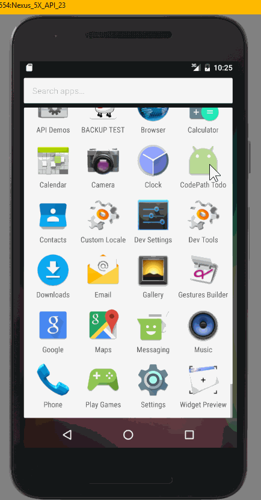

# CodePathTodo

This is the prework for CodePath's Android bootcamp and also my very first Android project. I have definitely learned a lot and I think I'm addicted.

Time spent: 6-7 hours spent in total

Completed user stories:

* [x] Required: Can you successfully add and remove items from the todo list within your app?
* [x] Required: Did you include support for editing todo items as described above?
* [x] Required: Does your app persist todo items and retrieve them properly on app restart?
* [x] Required: Did you successfully push your code to github? Can you see the code on github?
* [x] Required: Did you add a README.md to the repo on github which includes a GIF walkthrough of the app's functionality?
* [x] Required: Did you create an issue on the repo and include /cc @codepathreview @codepath in the issue body?
* [ ] Optional: Persist the todo items into SQLite instead of a text file
* [ ] Optional: Improve style of the todo items in the list using a custom adapter
* [ ] Optional: Add support for completion due dates for todo items (and display within listview item)
* [ ] Optional: Use a DialogFragment instead of new Activity for editing items
* [ ] Optional: Add support for selecting the priority of each todo item (and display in listview item)
* [ ] Optional: Tweak the style improving the UI / UX, play with colors, images or backgrounds

Notes:

I read the specifications of the requirements too hastily and ended up making an editing feature where the user stays on the same screen (Activity). I kept it as Main2Activity.

Walkthrough of app:

GIF created with [LiceCap](http://www.cockos.com/licecap/).
